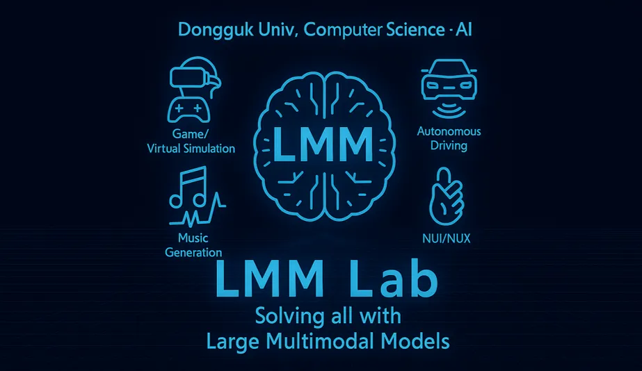

# LMMLab Github

### Welcome to the Large Multimodal Model Lab. at Dongguk University. By Professor Yunsick Sung, we study the core learning paradigms behind Large Models (LM). We develop LMM-based methods and systems for game/virtual simulation, autonomous driving, music creation, unmanned systems, and natural user interfaces/experiences (NUI/NUX). Join us if you want to build what actually works.
---
### Conctact Us

Homepage: https://lmmlab.notion.site/

E-Mail: sung@dgu.edu (Prof. Yunsick Sung)

---

